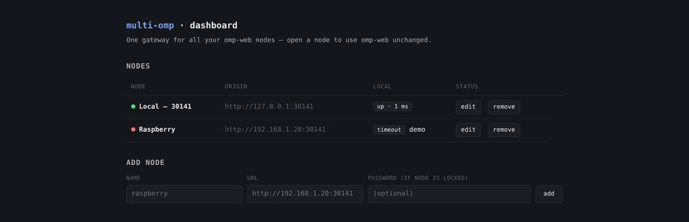
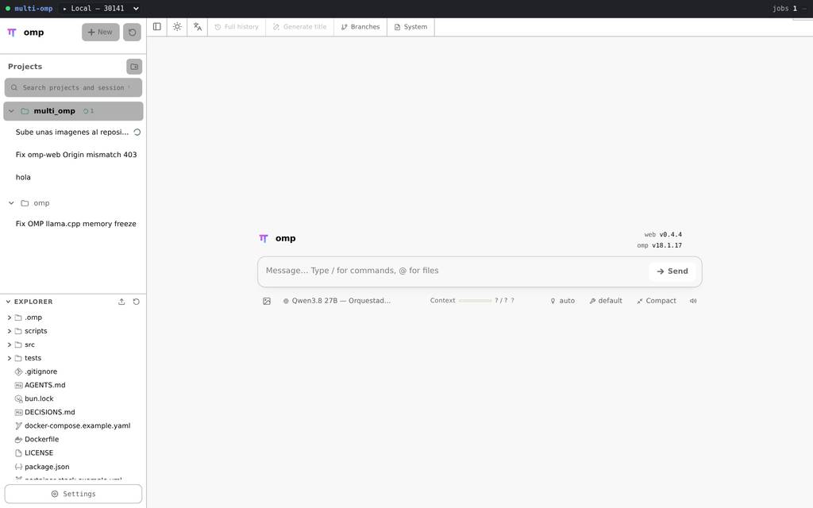
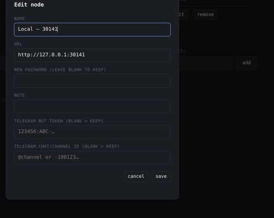

# multi-omp

**One gateway for all your [omp-web](https://github.com/omp-lang/omp-web) nodes — that's it, and it's that simple.**

omp-web instances live all over your network — a desktop, a Raspberry Pi, a
Debian box behind a VPN — each bound to `127.0.0.1`, each locked with its own
password. multi-omp sits on **one machine you can reach**, you register the
nodes once, and from then on every node gets its own clean local port with
omp-web running **completely unchanged**: same SPA, same API, same SSE streams,
byte-for-byte. No forking, no patching, no "wait for the next release" — add a
node, click open, done.

## Screenshots

The whole control plane is one page: register a node by name and URL, watch its
status update live, and open it.



And on every node page you get a thin bar at the top: the current node (▸), the
rest of your fleet with a live status dot, running jobs, and a marker when an
agent is waiting on *your* input. One click and you're on another node. The rest
of the page is omp-web, untouched.




```
browser ──► http://<gw-host>:30140/          dashboard + control plane
          http://<gw-host>:30201/            node "local"  ──► 127.0.0.1:30141 (omp-web)
          http://<gw-host>:30202/            node "rasp"   ──► 192.168.1.20:30141
```

## Architecture

Small on purpose — the whole thing is a handful of TypeScript files, no
framework, no database:
- **`src/gateway.ts`** — control-plane HTTP server (`Bun.serve`) on the gateway
  port (default `30140`): renders the dashboard, exposes the node-management
  REST API, and owns one proxy listener per node.
- **`src/proxy.ts`** — transparent reverse proxy. Forwards path+query+method+
  body as-is to the node origin with exactly three header modifications:
  rewrites `Host` (omp-web validates it) and `Origin` to the node's origin
  (omp-web's middleware 403s `/api/*` when `Origin` ≠ the request's own host —
  without this rewrite every API call from a proxied page is rejected and
  prompts silently vanish), and injects Basic auth from the local store.
  Response streams back unchanged (SSE included). The only rewrite: the
  node-switcher bar is appended to the root HTML document (see below) — API,
  SSE and asset responses pass through byte-for-byte.
- **`src/store.ts`** — node registry. `FileNodeStore` persists to
  `nodes.json` (`0600`) under `MULTI_OMP_HOME`; `MemoryNodeStore` for tests.
- **`src/ports.ts`** — per-node port allocation from `30200–30299`. Ports are
  stable (stored on the node record) and verified by a real bind before use,
  so a port held by the OS is skipped, never crashed on.
- **`src/upstream.ts`** — health checks: `200` = ok, `401` = ok+locked,
  `403` = host not allowed, anything else / timeout = down.
- **`src/dashboard.ts`** — single template string + vanilla JS. No framework.
- **`src/telegram.ts`** — per-node Telegram notifier: polls each node's
  omp-web session API and sends a message when a tracked session finishes a
  turn, waits for input, or resumes (each transition once, until the session
  leaves that state). Nodes opt in with a bot token + chat id (set in the
  dashboard node form); the token never leaves the gateway.

### Why per-node ports (and not a single-origin proxy)

The obvious alternative is one gateway origin with path prefixes
(`/n/<id>/...`) and rewritten HTML `<base>` tags. That breaks on Next.js:
omp-web is a prebuilt Next.js app whose client-side hydration re-emits
asset `<link>`/`<script>` tags from RSC flight data, discarding any server-side
prefixing — assets 404 and the SPA dies. Fixing that would require rewriting
streamed JS chunks, which is fragile and breaks on every omp-web release.
Serving each node at the **root of its own port** means every absolute path
(`/_next/...`, `/api/...`, `/recover`) resolves natively: zero rewriting,
zero coupling to omp-web's internals.

### Node-switcher bar

Every proxied node page carries a thin fixed bar at the top (injected into
the root HTML document only — API, SSE and asset responses are untouched):

- **Node select** — lists all registered nodes with the current one marked
  `▸`; choosing another navigates the browser to that node's local proxy
  origin, so switching nodes is a full page load of the other node.
- **Status dot** — green (up), yellow (up, locked), red (down) for the
  current node, live from `GET /api/health`; down/locked nodes are labeled
  in the select.
- **Live metrics** — running job count and an "awaiting you" marker when the
  node's agent is waiting on your input (pink dot).
- **Hide button** — hides the bar for this browser only (`localStorage`).
  While hidden, a small "▤ multi-omp" chip stays pinned at the bottom-left
  corner of every node page; clicking it brings the bar back.

The bar reuses omp-web's dark theme tokens and has no external dependencies.

### Telegram notifications

Leave your desk without losing the thread. Opt any node in to Telegram: open
**edit** on that node, paste a bot token and a chat/channel id, save. That's
the whole setup — from then on, the gateway polls the node's sessions and pings
you the moment a session starts, finishes a turn, stops to wait for your input,
or disappears. One message per node per state change, each with a direct link
back to the node. The token never leaves the gateway, and it's yours to revoke
anytime.



## Quick start

Two commands, one open tab, and your whole fleet is behind one URL:

```sh
bun install
bun src/index.ts                       # dashboard on http://127.0.0.1:30140
```

Open the dashboard and add your first node — a name, a URL, and a password if
the node is locked. Hit **add**, watch the status dot turn green, and open it.
That's the whole setup.

Prefer the terminal? Same thing, no UI needed:

```sh
curl -X POST http://127.0.0.1:30140/api/nodes \
  -H 'content-type: application/json' \
  -d '{"name":"Raspberry","url":"http://192.168.1.20:30141","username":"omp","password":"..."}'
```

Every node gets its own local port from `30200–30299` (the "Local" column) and
keeps it across restarts — so your bookmarks and muscle memory survive. If a
saved port is already taken at boot, the gateway retries it for 15 seconds and
then picks a free one and remembers that instead; no crashes, no guessing. And
the gateway's own port (30140) is never handed out to a node, even if an old
`nodes.json` claims otherwise.

## Configuration (env)

| Var | Default | Meaning |
|---|---|---|
| `MULTI_OMP_HOME` | `~/.omp/multi-omp` | Data dir; nodes live in `$HOME/nodes.json` |
| `MULTI_OMP_NOTIFIER_MS` | `10000` | Telegram notifier poll interval; `0` disables it |
| `MULTI_OMP_PORT` (or `PORT`) | `30140` | Gateway port |
| `MULTI_OMP_HOST` | `127.0.0.1` | Bind address |

## Docker

No Bun on the machine? No problem — one image, done:

```sh
docker build -t multi-omp .
```

Then pick your favorite launch and you're up:

```sh
# the full example (builds for you, adds the host.docker.internal mapping):
docker compose -f docker-compose.example.yaml up -d

# or just run it:
docker run -d --name multi-omp --restart unless-stopped \
  -p 30140:30140 -p 30200-30299:30200-30299 \
  -v ./data:/data -e MULTI_OMP_HOME=/data -e MULTI_OMP_HOST=0.0.0.0 \
  --add-host host.docker.internal:host-gateway \
  multi-omp
```

Or deploy `portainer-stack.example.yml` as a Portainer stack (build the
image first: `docker build -t multi-omp:latest .`). Either way: the dashboard
lands on `30140`, every node on its own port from `30200-30299`, and the
registry persists in the `data/` volume. One thing to know: node URLs must be
reachable **from inside the container** — `http://host.docker.internal:30141`
for a node on the same machine (the `extra_hosts` mapping does that for you),
a real LAN IP for remote nodes. Then it's the same quick start as above.

## API

| Method & path | Result |
|---|---|
| `GET /` | dashboard (HTML) |
| `GET /api/health` | `{ statuses: [{ id, status }] }` for all nodes |
| `GET /api/nodes` | `{ nodes: [...] }` (no passwords; `hasPassword` flag) |
| `GET /api/nodes/:id` | `{ node, status }` |
| `POST /api/nodes` | create `{ name, url, username?, password?, note? }` → `201 { node, status }` |
| `PATCH /api/nodes/:id` | partial update; `url`/credential changes take effect immediately (no restart). Send `password` or `username` as `null` to clear |
| `DELETE /api/nodes/:id` | remove node and stop its listener |

## Security

- Gateway binds `127.0.0.1` by default. To expose it on a LAN, set
  `MULTI_OMP_HOST` and put it behind TLS/auth — anything that can reach it can
  read node statuses and manage the registry.
- Credentials are stored only in `nodes.json` (mode `0600`), never sent to the
  browser (API responses carry `hasPassword` instead). Telegram bot tokens live
  in the same file and are used server-side only.
- The proxy injects `Authorization` server-side; the browser never sees node
  passwords.
- Node listeners accept connections from any interface the gateway host
  exposes; the dashboard's Open links work from other machines on the LAN.

## Future compatibility

The proxy is deliberately near-opaque: it forwards bytes and never parses
JS or routes. The single documented rewrite is appending the node-switcher
bar to the root HTML document (a string append before `</body>`, no parsing).
A new omp-web version (new chunks, new routes, markup changes) is served
unchanged. The only contract multi-omp relies on:

1. omp-web listens on the configured host:port and answers `GET /` (for
   health checks).
2. Its host-header validation accepts the node's own host (true by default
   for IP/localhost; see omp-web's `OMP_WEB_ALLOWED_HOSTS`) — the proxy
   rewrites both `Host` and `Origin` to the node's origin, so the node's
   middleware sees a same-origin request from its own page.

## Development

```sh
bun test                # unit + integration; smoke auto-skips if no omp-web at :30141
bun run typecheck       # tsc --noEmit
```
